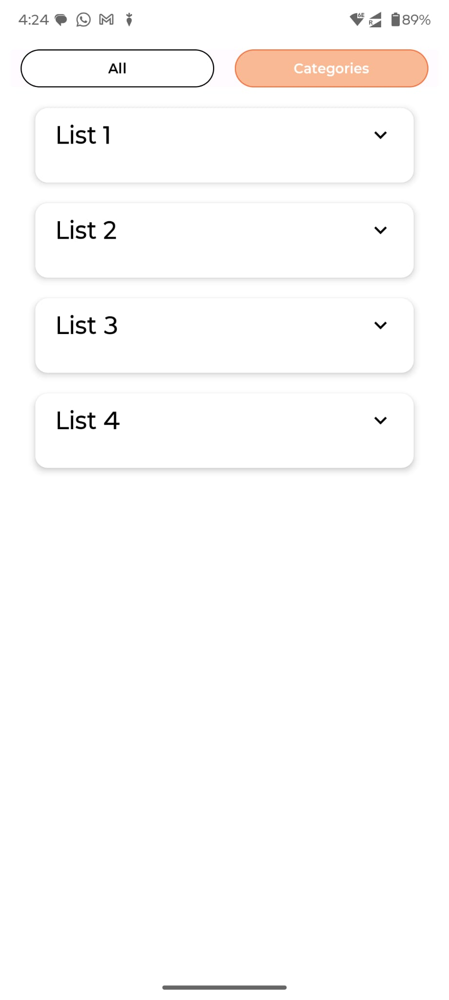

# Fetch Rewards Coding Exercise - Android Internship

## Overview
This is a **Jetpack Compose** Android application built with Kotlin that fetches and displays a list of items from [this API](https://fetch-hiring.s3.amazonaws.com/hiring.json). The data is processed and displayed based on the following requirements:

## Features
- **Data Fetching**: Retrieves JSON data from the provided API.
- **Data Processing**:
   - Filters out items where the `"name"` is blank or `null`.
   - Groups items by `"listId"`.
   - Sorts items **first by `"listId"` and then by `"name"`**.
- **Modern UI with Jetpack Compose**:
   - Utilizes **LazyColumn** for efficient list rendering.
   - Smooth UI experience with **Material Design components**.
- **Additional Enhancements**:
   - **Splash Screen**: Displays an engaging startup animation.
   - **Custom Launcher Icon**: Gives the app a polished look.

## Sorting Behavior
- The sorting follows the requirement of ordering by `"listId"` first and then by `"name"`.
- **Note:** The `"name"` sorting is performed lexicographically (alphabetically), meaning:
   - If numeric values are included in `"name"`, they are treated as text, leading to cases where `"List 11"` appears before `"List 2"` (instead of `"List 2"`, `"List 11"`, `"List 222"`).
   - **This behavior is expected**, as the requirement specifies sorting by name directly. If numeric-aware sorting is required in the future, enhancements can be made to split numeric and text parts. This is not implemented currently as names generally do not contain numbers and the requirement is to sort according to names.

- **Splash Screen**: A startup screen before navigating to the main content.
- **Custom Launcher Icon**: A unique app icon for branding.
- **Jetpack Compose UI**: Fully built using the latest **Compose UI**.
- **Networking with Retrofit**: Fetches and processes data asynchronously.
- **MVVM Architecture**: Ensures separation of concerns and better maintainability.
- **Coroutines & Flow**: For efficient background operations.
- **Material 3 Design**: Provides a sleek and modern UI.

---

## Screenshots
| All                                          | Categories                                   | Favorites                                        |
|----------------------------------------------|----------------------------------------------|--------------------------------------------------|
|         |  |        |

---

## Tech Stack
- **Language**: Kotlin
- **UI Framework**: Jetpack Compose
- **Architecture**: MVVM (Model-View-ViewModel)
- **Networking**: Retrofit + Gson
- **State Management**: `remember`, `StateFlow`
- **Asynchronous Processing**: Coroutines + Flow
- **Material 3**: Latest Material UI components

---

### Prerequisites:
- **Minimum SDK**: 24
- **Compile SDK**: 35

### Steps:
1. **Clone the repository**
   ```sh
   git clone https://github.com/yourusername/fetch-rewards-app.git
